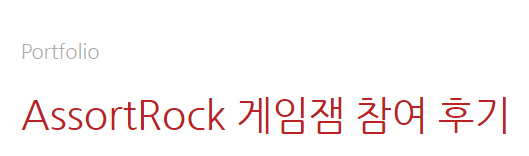

# $\large\bf\color{#556B2F}DirectX11\ Game\ Jam\ Project$

### $\large\bf\color{#CD5C5C}프로젝트\ 명$
BBounce Ball

### $\large\bf\color{#CD5C5C}프로젝트\ 인원$
4명 (김기훈 외 3인)

### $\large\bf\color{#CD5C5C}프로젝트\ 기간$
2023/09/25 ~ 2023/10/15

### $\large\bf\color{#CD5C5C}목적$
① DirectX11 기반 엔진의 구조와 흐름에 대한 이해 
② C/C++, DirectX11 의 활용 능력의 향상 
③ 기능 구현 및 응용 능력 향상 
④ 팀 프로젝트 경험을 통한 협업능력 향상 
⑤ 형상관리 툴 (Git) 활용능력 향상 

### $\large\bf\color{#CD5C5C}담당역할$
-&nbsp;조장 
-&nbsp;PPT 제작 및 발표 
-&nbsp;Git 과 GitHub에 대한 지식을 조원들에게 전달하고 GitHub 관리 담당 
-&nbsp;Stage4 제작 
-&nbsp;Player FSM 구현 
-&nbsp;Floor 객체에 추가할 Script 중 Basic Floor / Disappear Script를 구현 
-&nbsp;Floor 와 Player 의 충돌조건 로직 구현 
-&nbsp;충돌시 Floor Collider 색 변경 이펙트 로직 구현 
-&nbsp;상수버퍼와 관련된 전반적인 로직 구현 

### $\large\bf\color{#CD5C5C}진행 계획$
1주차 : 일정 조율 및 진행 계획 토의, 엔진에 필요한 기본 기능 추가
 
2주차 : 플레이어 , 아이템, Floor 기능 구현
 
3주차 : Stage 제작 및 버그 수정

### $\large\bf\color{#CD5C5C}결과물$
<b>[ Blog URL ]</b> 
$\color{#4F4F4F}(\ ↓ 이미지\ 클릭시\ 해당\ 페이지로\ 이동합니다.↓\ )$ 

 

<b>[ Notion URL ]</b> 
$\color{#4F4F4F}(\ ↓ 이미지\ 클릭시\ 해당\ 페이지로\ 이동합니다.↓\ )$ 

 

### $\large\bf\color{#CD5C5C}타임라인$
<b>23/09/25 :</b> 
[프로젝트 시작] 
-&nbsp;Engine 초기 상태 업로드 

<b>23/09/26 :</b> 
-&nbsp;Collider 클래스 , Rigidbody 클래스 추가 
-&nbsp;Vertex Shader 파일 수정 (TriangleVS.hlsl) 
-&nbsp;LoadBuffer 수정 

<b>23/09/27 ~ 10/04 :</b> 
[ 연휴 ] 

<b>23/10/05 :</b> 
-&nbsp;Collider 클래스 수정  : Vector2 -> Vector3 수정 
-&nbsp;CollisionManager 클래스 추가 (역할 : 충돌 처리)  
-&nbsp;Rigidbody 클래스 수정 : Vector2 -> Vector3 수정 
-&nbsp;화면에 Circle, Rectangle 출력 

<b>23/10/06 :</b> 
-&nbsp;Floor, Player, Collier, Color 관련 상수 버퍼 수정 
-&nbsp;Vertex Shader 파일 수정 (TriangleVS.hlsl) 
-&nbsp;Player-Floor 옆면 충돌 시 Y 축 AddForce 안되도록 반영 
-&nbsp;Test Scene 블록 배치 및 간단한 맵 구성 

<b>23/10/07 :</b> 
-&nbsp;Player 속성 초기화 코드 SceneManger->Player/Initialize() 이동 

<b>23/10/08 :</b> 
-&nbsp;Floor - Player Y 축 충돌 시 Y 축으로 AddForce 되도록 반영 
-&nbsp;Collider 화면 출력 관련 Flag 값 생성 
-&nbsp;Test Scene 벽돌 구성 변경 

<b>23/10/09 :</b> 
-&nbsp;Block 크기 협의 및 통일 
-&nbsp;Block 크기 조정으로 인한 Block-Player 충돌 시 Force 값 수정 
-&nbsp;Player Dead 조건 추가 및 적용 
-&nbsp;Script를 통한 Mesh 추가 가능하도록 엔진 수정 

<b>23/10/10 :</b> 
-&nbsp;Floor 객체에 적용할 Script 논의 및 클래스 추가 (SuperJump, DoubleJump, Portal, Straight, Spike) 

<b>23/10/12 :</b> 
-&nbsp;Script 구현 시작 
-&nbsp;Script 추가 (Portal In/Out, Basic) 
-&nbsp;Item 클래스 생성하여 Floor 클래스와 기능 구별 
-&nbsp;Item 클래스에 추가할 Script 로 Star 클래스 추가 

<b>23/10/13 :</b> 
-&nbsp;스테이지 클리어 조건 Scene 클래스에 적용 
-&nbsp;Item 습득 시 Player 색 변경되도록 적용 
-&nbsp;Stage 추가 시작(Stage2) 

<b>23/10/14 :</b> 
-&nbsp;Stage1,3 추가 
-&nbsp;각 Stage 클리어 시 다음 스테이지로 넘어가도록 적용 
-&nbsp;Floor Move Script 추가 

<b>23/10/15 :</b> 
-&nbsp;Stage4 추가 
-&nbsp;End Scene 추가 및 적용 

<b>23/10/16 :</b> 
[프로젝트 마무리 및 발표] 
