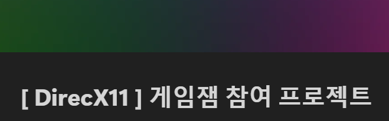

# $\large\bf\color{#556B2F}DirectX11\ Game\ Jam\ Project$

### $\large\bf\color{#CD5C5C}프로젝트\ 명$
BBounce Ball

### $\large\bf\color{#CD5C5C}프로젝트\ 인원$
4명 (김기훈 외 3인)

### $\large\bf\color{#CD5C5C}프로젝트\ 기간$
2023/09/25 ~ 2023/10/15

### $\large\bf\color{#CD5C5C}목적$
① DirectX11 기반 엔진의 구조와 흐름에 대한 이해 
② C/C++, DirectX11 의 활용 능력의 향상 
③ 기능 구현 및 응용 능력 향상 
④ 팀 프로젝트 경험을 통한 협업능력 향상 
⑤ 형상관리 툴 (Git) 활용능력 향상 

### $\large\bf\color{#CD5C5C}진행 계획$
1주차 : 
 
2주차 : 
 
3주차 : 

### $\large\bf\color{#CD5C5C}Notion\ URL$

 

### $\large\bf\color{#CD5C5C}Naver\ Blog\ URL$

 

### $\large\bf\color{#CD5C5C}타임라인$
<b>23/09/25 :</b> 
[프로젝트 시작] 

<b>23/10/15 :</b> 
[프로젝트 마무리 및 발표] 